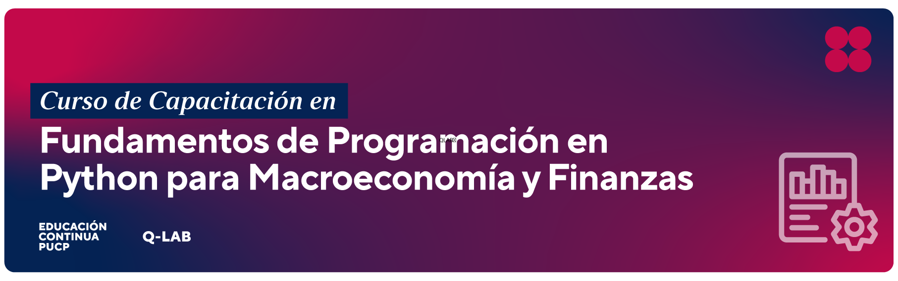

  

## 1.	Información General

| | | 
|:-------------------|---|
| Nombre del curso		|  Fundamentos de Programación en Python para Macroeconomía y Finanzas  | 
| Profesor del curso		|  Victor Fuentes Campos  | 
| Correo electrónico PUCP	|  vfuentes@pucp.edu.pe| 

## 2. Sumilla

Este curso está diseñado para contribuir al desarrollo de habilidades de programación con Python e incoporarlo como una caja de herramientas para la investigación cuantitativa. El curso está dirigido a estudiantes con poca o sin experiencia en programación, pero que están interesados en aprender como la ciencia de datos convierte datos en conocimiento para la toma de decisiones. El curso cubrirá aspectos básicos de programación en Python, librerías NumPy y Pandas, visualización de datos, web scrapping, APIs y procesamiento del lenguaje natural (NLP).

## 3.	Presentación 

Este curso está dirigido a estudiantes de ciencias sociales con poca o sin experiencia previa con lenguajes de programación, o que recién han comenzado a utilizar programas estadísticos como Stata, y les ha resultado atractiva la interacción con los datos mediante código. El curso busca preparar a los estudiantes para el mercado laboral, al brindar una habilidad altamente demandada, y que será una útil para un primer trabajo o práctica que involucre la ciencia de datos.

## 4. Resultados de aprendizaje

1. Aprender cómo usar GitHub y posiblemente crear tu sitio web académico o técnico
1. Comprender conceptos básicos de programación como variables, funciones, loops y condicionales
1. Escribir programas sencillos en Python para resolver problemas reales
1. Comprender y utilizar diversos tipos de datos en Python, incluyendo listas, diccionarios y tuples
1. Utilizar librerías y módulos de Python para realizar tareas como análisis de datos y computación científica
1. Comprender y aplicar conceptos de programación orientada a objetos y funcional en Python
1. Utilizar Python para interactuar con APIs web y extraer información de páginas web (web scraping).

## 5. Metodología

Las clases se desarrollarán de forma síncronica a través de Zoom (ver Canvas). En las aplicaciones de clase se usarán bases de datos vinculados, en la medida de lo posible, a la macroeconomía y las finanzas.

## 6. Evaluación

La evaluación consiste en cuatro tareas y un trabajo final.

| # | Tipo de evaluación | Peso en la nota final |
|:-------------------|---| ---|
| 4 | Tareas | 80% |
| 1 | Trabajo final | 20%|

## 7. Bibliografía obligatoria

1.	"Python for Data Science Handbook" by Jake VanderPlas (O'Reilly, 2017) 
1.	"Python Crash Course" by Eric Matthes (No Starch Press, 2015) 
1.	"Python for Everyone" by Horstmann and Reed (Wiley, 2015)
1.	Stackoverflow

## 8. Cronograma tentativo

|Fecha|Temas|Subtemas|
|---|---|---|
3 de enero |  Github & Python   Objetos básicos   | • Installation  • Branches  • Repository   • Lists   • Dictionaries  |
5 de enero | Pandas & NumPy| • NumPy  • Series   • Indexing  • Importing Data   • Data wrangling  |
9 de enero |  Control Structures Functions Classes | •  If condition   •  For loop  •  While Loop  •  Function Definitions   •  *args and **kwwargs   •  \_init_  •  Attributes and Methods    |
10 de enero| APIs|   • Google Directions  • Geolocation  • Finance APIs   |
12 de enero| NLP|   •  GPT-4   •  Transformers |

## 9. Grupos

| Grupo| Integrante Nº 1 | Integrante Nº 2 |
|---|---|---|
|1|Mateo Podesta Alvarado |  Marco Gregorio Bravo|
|2|Elias Gomez Huamani |  Gustavo Torres Flores|
|3|Angel Rojas Chavez |  Anghely Lozano Rojas|
|4|Joshua Quispe Vazquez | Jorge Dongo Gutierrez |
|5| Luis Cahuana Bautista |  |
|6|Patricia Mendoza Arce |  Jakelin Remon Godoy|
|7|Piero Fernandez Davila Velazco |  Rafael Vilca Romero|
|8|Adriana Torres Quiroz |  Néstor Canales Anyosa|
|9|Adriana Arce Jaimes |  Braulio Mundaca Lechuga|
|10| Jherson Cueva Mendoza | Luis Portocarrero Pinedo|| 

## 10. Recursos adicionales

1. Videos tutoriales
- https://www.youtube.com/watch?v=zyGfECfJ9BY
- https://www.youtube.com/watch?v=K5xImVmm2Ds

2. Plantillas
- https://bootstrapmade.com/bootstrap-portfolio-templates/
- https://cssauthor.com/free-bootstrap-portfolio-templates/
